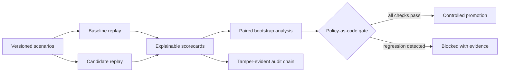

# EvalForge

[](https://github.com/mzatylny/evalforge/actions/workflows/ci.yml)
[](https://github.com/mzatylny/evalforge/actions/workflows/codeql.yml)
[](https://www.python.org/)
[](LICENSE)

**An evidence-driven release control tower for production AI agents.** EvalForge replays a
matched scenario suite against a baseline and candidate, produces explainable scorecards,
estimates the paired quality delta, and blocks releases that violate quality, safety, latency,
or cost budgets.

It is deliberately provider-neutral and includes a deterministic local runner: reviewers can
experience the complete workflow without API keys, paid model calls, or synthetic screenshots.

## The problem it solves

Agent changes are difficult to review as ordinary code diffs. A prompt revision can improve
cost while silently breaking a tool path; a model migration can look better on average while
introducing a critical safety regression. EvalForge turns those trade-offs into a repeatable,
auditable release decision.



## Senior engineering signals

- **Evaluation design:** matched baseline/candidate experiments, deterministic replay, ordered
  tool-path grading, critical-scenario hard failures, and explainable failure codes.
- **Statistical discipline:** paired deltas and a seeded 95% bootstrap confidence interval rather
  than a misleading comparison of unrelated averages.
- **Operational gates:** minimum sample size, task-success regression budget, quality confidence,
  p95 latency, mean cost, and zero-new-policy-failure checks.
- **Production boundaries:** API-key tenant isolation, strict request schemas, constant-time key
  comparison, bounded payloads, safe response headers, health/readiness endpoints, and metrics.
- **Evidence integrity:** append-only SHA-256 hash chaining detects audit-history modification.
- **Reproducibility:** local deterministic demo, pinned dependency ranges, container hardening,
  test coverage gate, static analysis, dependency audit, CodeQL, and Dependabot.

## Run the control tower

```bash
python -m venv .venv
source .venv/bin/activate
python -m pip install -e ".[dev]"
evalforge serve
```

Open [http://localhost:8000](http://localhost:8000), keep the local development key shown in the
dashboard, and select **Run canary evaluation**. The demo replays 40 matched scenarios. Its
candidate is intentionally faster and cheaper but introduces quality and policy regressions, so
the release gate blocks it and explains why.

You can also run the evidence pipeline without a server:

```bash
evalforge --database /tmp/evalforge.db demo
evalforge --database /tmp/evalforge.db verify-audit
```

## API workflow

Use a different, high-entropy key outside local development:

```bash
export EVALFORGE_API_KEYS='team-a:replace-with-a-long-random-secret'
export EVALFORGE_ENV=production
evalforge serve
```

Create a versioned scenario, ingest agent traces, and query release evidence through `/api/v1`.
Interactive OpenAPI documentation is available at `/docs` in development. The API never accepts a
tenant identifier from a client; tenant scope is derived from the authenticated key.

## Scoring model

Each trace receives a scorecard composed of output-contract coverage, ordered tool-path coverage,
policy compliance, latency, and cost. Safety violations and missing critical tool paths are hard
failures. The default weighted score is:

```text
0.45 output + 0.20 tools + 0.20 policy + 0.10 latency + 0.05 cost
```

The weights are intentionally explicit and deterministic. LLM-as-judge can be added behind the
same evaluator boundary, but a non-deterministic judge is not treated as ground truth. See
[Evaluation Methodology](docs/EVALUATION_METHODOLOGY.md).

## Repository map

```text
src/evalforge/
├── api.py          FastAPI control plane and tenant boundary
├── gates.py        Paired statistics and policy-as-code release decision
├── replay.py       Provider-neutral runner and failure reducer
├── scoring.py      Deterministic multi-signal evaluator
├── service.py      Experiment orchestration
├── storage.py      SQLite evidence store and audit hash chain
└── static/         Responsive release-control dashboard
```

## Engineering documents

- [Architecture](docs/ARCHITECTURE.md)
- [Evaluation methodology](docs/EVALUATION_METHODOLOGY.md)
- [Operations runbook](docs/OPERATIONS.md)
- [Threat model](docs/THREAT_MODEL.md)
- [ADR-0001: deterministic core](docs/adr/0001-deterministic-core.md)
- [Security policy](SECURITY.md)

## Quality gates

```bash
make check
```

The pipeline enforces formatting and linting, branch-aware coverage of at least 90%, Bandit,
dependency auditing, CodeQL, and a reproducible container build.

## Scope

EvalForge is a portfolio-grade control plane, not a hosted multi-region SaaS. SQLite is a strong
local and single-instance evidence store; a production deployment with concurrent replicas should
implement the documented storage interface using PostgreSQL and managed secrets. This boundary is
intentional and discussed in the architecture documentation.

## License

[MIT](LICENSE)
