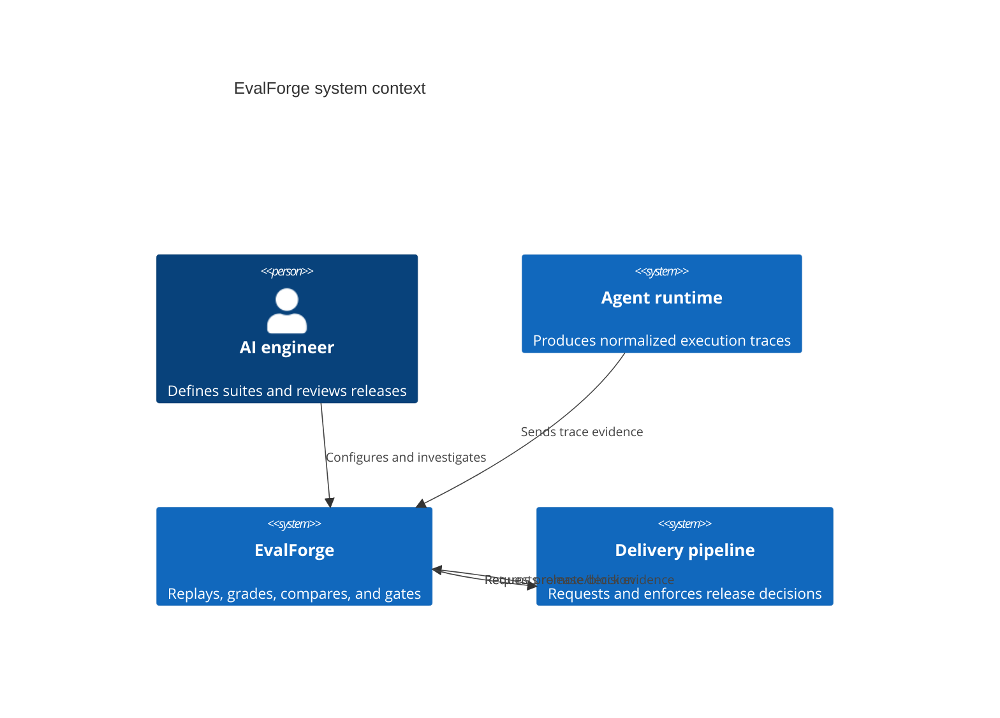

# Architecture

## System context

EvalForge sits between an agent delivery pipeline and a promotion decision. Agent runtimes emit a
normalized trace. Scenario suites describe expected outcomes and tool paths. The control plane
evaluates both a production baseline and release candidate, compares matched results, and records a
policy decision with immutable evidence.

## Component boundaries

| Component | Responsibility | Does not own |
| --- | --- | --- |
| Replay runner | Execute a scenario against a named variant | Release policy |
| Evaluator | Convert one trace and scenario into an explainable scorecard | Cross-variant statistics |
| Comparator | Analyze matched scorecards and uncertainty | Promotion authority |
| Gate engine | Apply versioned operational policy | Trace execution |
| Storage | Enforce tenant-scoped persistence and evidence integrity | Authentication policy |
| API | Authenticate, validate, bound, and route requests | Scoring semantics |

These boundaries make provider adapters, storage engines, and optional judge implementations
replaceable without changing release semantics.

## Data flow and invariants

1. API authentication maps a high-entropy key to exactly one tenant. Client input cannot override
   tenant scope.
2. A scenario is versioned externally by its stable identifier and metadata.
3. A runner emits a normalized trace. The evaluator never needs provider-specific response types.
4. Baseline and candidate results are matched by scenario identifier. Unmatched samples are not
   used for paired inference.
5. A release decision is stored with the exact policy values used to create it.
6. Every scenario, trace, experiment, and decision mutation appends an audit event whose digest
   includes the previous event digest.

## Persistence

SQLite runs in WAL mode and is appropriate for local evaluation, CI, and a single control-plane
instance. Queries use bound parameters and explicit tenant predicates. For horizontal production
deployment, preserve the `Storage` contract in a PostgreSQL adapter, use database-enforced row-level
security, and wrap experiment plus decision persistence in a serializable transaction.

## Scaling path

- Move replay work to a queue with tenant-aware concurrency and budget limits.
- Persist full spans in object storage; keep searchable trace summaries in PostgreSQL.
- Export counters and histograms to OpenTelemetry/Prometheus infrastructure.
- Sign release decisions with a workload identity and verify them in the deployment admission path.
- Add a scenario registry with immutable versions and reviewer approval metadata.

## Failure handling

The gate defaults to fail-closed: insufficient paired samples yield `needs_more_data`; any failed
quality, latency, cost, or safety check yields `blocked`. A control-plane outage must never be
interpreted as a promotion. Delivery systems should require a fresh, signed `promoted` decision.
